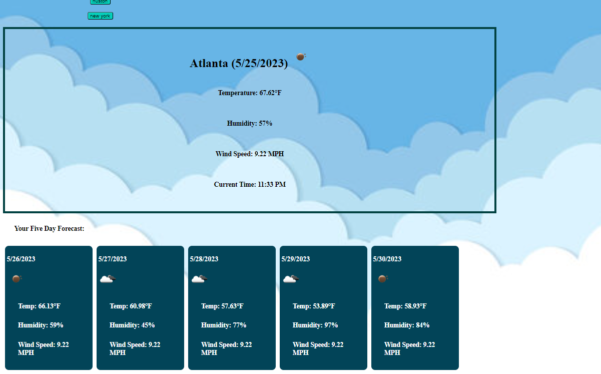

# API Weather Dashboard


## api-weather-dashboard

<br></br>

## Description
This project is a weather dashboard using the OpenWeather API.

## The Task

The challenge is to build a weather dashboard that will run in the browser and feature dynamically updated HTML and CSS using the 5 Day Weather Forecast API.


##  Features :

1) Search box for cities
2) Current weather for selected city
3) Previously searched cities are saved

<br></br>
## Development Tools:
<br>
<div align = "center">


</div>

<br></br>

## User Story

```md
AS A traveler
I WANT to see the weather outlook for multiple cities
SO THAT I can plan a trip accordingly
```

## Acceptance Criteria

```md
GIVEN a weather dashboard with form inputs
WHEN I search for a city
THEN I am presented with current and future conditions for that city and that city is added to the search history
WHEN I view current weather conditions for that city
THEN I am presented with the city name, the date, an icon representation of weather conditions, the temperature, the humidity, and the the wind speed
WHEN I view future weather conditions for that city
THEN I am presented with a 5-day forecast that displays the date, an icon representation of weather conditions, the temperature, the wind speed, and the humidity
WHEN I click on a city in the search history
THEN I am again presented with current and future conditions for that city
```

<br></br>

# UI SneakPeak ❤️ 




<br><br>

# Refrences

- <a href="https://openweathermap.org/forecast5">OpenWeatherAPI</a>

- <a href="https://www.w3schools.com">w3schools</a>

- Ask BCS

- <a href = "https://calendly.com/d/dnc-wpf-c7s">UCF Tutors</a>

- <a href = "https://developer.mozilla.org/en-US/docs/Web/API/Fetch_API/Using_Fetch">Mozilla APIs</a>

**For more, reach me at laryn.n99@gmail.com**

<br>
